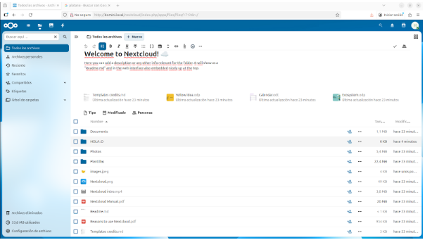
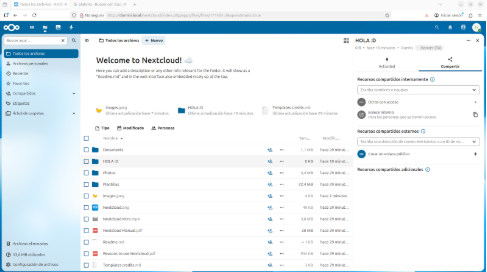

# Configuración del NextCloud

## 1. Cómo funciona:

- Al momento de querer subir una imagen o algún tipo de documento tienes que acceder a la zona de archivos y das click donde dice `Nuevo`y ahi podras seleccionar el archivo que deseas subir al NextCloud
-  

- Lo msimo sucede con las carpetas, una vez presionado el apartado `nuevo`, Te aparece la opción de crear carpeta
-   

- Una vez creada la carpeta, al lado de ella aparecen `3 puntos`los cuales si los presionas entras a un apartado donde hay varias opciones la cuál entre ellas aparece la opción de compartir

  

## 2. Crear Usuario

-Para crear un usuario nuevo dentro del NextCloud tienes que acceder al apartado de `All accounts` accediendo a este desde tu perfil, y te aparecerá el apartado de `New account`, en el cuál podrás crear tu usuario con permisos, roles y añadirlos a grupos especificos.

  
